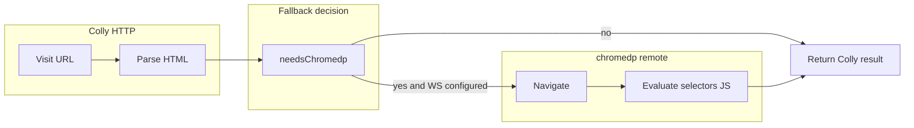

# Version 2.0: Smart chromedp / Lightpanda integration

## Current state (baseline)

- **Already implemented:** `github.com/chromedp/chromedp` with `chromedp.NewRemoteAllocator` against `[LIGHTPANDA_WS_URL](internal/config/config.go)` (mapped to `Crawler.ChromedpWSURL`). `[ScrapeHTMLViaChromedp](internal/crawler/chromescrape.go)` navigates, `WaitReady("body")`, then `Evaluate(SelectorsJS(...))` to pull inner HTML for the same selector list as Colly.
- **Fallback gate today:** `[scrapeNeedsChromedpFallback](internal/crawler/colly.go)` only runs when `LIGHTPANDA_WS_URL` is set **and** one of: Colly visit error, nil result, `metadata["error"]` set, or `**onlyMainContent` is effectively true** and main markdown is shorter than 80 runes. It does **not** inspect HTTP status or HTML for bots/CSR.
- **Crawl path:** `[performCrawling](internal/api/crawl_manager.go)` calls `crawler.ScrapeURL` per visited URL, so improving `finalizeScrape` automatically improves crawl results (no separate crawl-only browser path required).
- **Infra:** `[docker-compose.yml](docker-compose.yml)` already runs `lightpanda/browser:nightly` on `9222`; gocrawl does not inject `LIGHTPANDA_WS_URL` by default (operators must copy the full `webSocketDebuggerUrl` from the CDP HTTP endpoint).

## Gaps to close for “2.0”

| Gap                              | Why it matters                                                                                                                                                                                            |
| -------------------------------- | --------------------------------------------------------------------------------------------------------------------------------------------------------------------------------------------------------- |
| No status-based fallback         | `403`/`401`/`429` often return HTML bodies; Colly “succeeds” with a challenge page—today that may **not** trigger chromedp when `onlyMainContent` is false or markdown is non-trivial garbage.            |
| No challenge/captcha signals     | Same as above: need cheap string/heuristic checks on title/body (e.g. Cloudflare/“captcha”/“verify you are human”) after a successful HTTP response.                                                      |
| CSR detection is one-dimensional | Thin markdown only applies when main-content mode is on; SPAs with `onlyMainContent: false` can still serve an empty shell in `#root` with lots of script noise.                                          |
| Browser session vs HTTP          | CDP navigation should align **User-Agent** (and optionally viewport/locale) with `[cfg.Crawler.UserAgent](internal/crawler/colly.go)` so behavior is consistent and slightly less fingerprint-mismatched. |
| No hydration wait                | `WaitReady("body")` is often too early for CSR; a short fixed delay and/or polling (e.g. repeat evaluate until main selector has sufficient text length or timeout) reduces empty extractions.            |
| Operator friction                | Full `ws://.../devtools/browser/...` is tedious; optional **HTTP base** (e.g. `http://lightpanda:9222`) + lazy fetch of `webSocketDebuggerUrl` from `/json/version` improves Compose ergonomics.          |
| Unbounded chromedp               | Crawl fan-out × per-page fallback can stampede Lightpanda; a **semaphore** (configurable max concurrent CDP sessions) avoids overload.                                                                    |

**Reality check (docs + expectations):** Lightpanda/chromedp improves **JS execution and many simple bot walls**, but **does not guarantee** bypass of sophisticated anti-bot (TLS fingerprinting, CAPTCHA vendors, strict TLS/JA3 rules). The plan should state that in README; hard cases may still need residential proxies, human-in-loop, or a full Chrome profile—out of scope unless you explicitly expand.

## Proposed implementation

### 1. Centralize and expand fallback logic

- Add a small, testable function (e.g. in `internal/crawler/` next to `[colly.go](internal/crawler/colly.go)` or `fallback.go`) that takes: `visitErr`, `*ScrapeResult` (including `Metadata`, `RawHTML`/`HTML`/`Markdown` as available), and `onlyMain bool`.
- **Triggers (OR semantics), when `ChromedpWSURL` is set:**
  - Keep existing: visit error, missing result, `metadata["error"]`, thin main markdown (< 80 runes when main-content mode).
  - **HTTP status:** parse `metadata["statusCode"]`; treat configurable set as fallback-worthy (default at least `401`, `403`, `429`; consider `503`).
  - **Challenge HTML:** case-insensitive substring checks on concatenated title + first N KB of raw/body HTML for known patterns (Cloudflare, “captcha”, “verify you are human”, “attention required”, etc.)—keep list data-driven and easy to extend.
  - **CSR / SPA shell:** e.g. detect common mount nodes (`#root`, `#__next`, `[data-reactroot]`) with **very low inner text length** but **large HTML** or presence of framework markers (`__NEXT_DATA__`, `window.__NUXT__`, etc.); apply even when `onlyMainContent` is false so full-page mode still escalates.
- Record **why** fallback ran in metadata (e.g. `chromedpTrigger: status_403` | `thin_markdown` | `challenge_html` | `spa_shell`) for debugging and client transparency.

### 2. Harden `ScrapeHTMLViaChromedp`

- After allocator/context creation, run `**network.SetUserAgentOverride`** (or chromedp’s emulation helper) to match `cfg.Crawler.UserAgent`.
- Add optional **post-navigation wait**: config-driven `CHROMEDP_NAV_WAIT` (duration) and/or loop: sleep + re-evaluate until main selector text length > threshold or cap iterations (reuse same selector list as today).
- Preserve current `SelectorsJS` behavior in `[selectors.go](internal/crawler/selectors.go)`; only extend if you need a second “full body” evaluate path for diagnostics (optional).

### 3. Config and Compose

- **Config** (`[internal/config/config.go](internal/config/config.go)`): add fields such as `LightpandaHTTPURL` (optional), `ChromedpMaxConcurrent`, `ChromedpNavWait`, maybe `ChromedpFallbackStatusCodes` as a slice from env (comma-separated) with sensible defaults.
- **Resolve WebSocket URL:** if `LIGHTPANDA_WS_URL` is empty but `LIGHTPANDA_HTTP_URL` (or similar) is set, on first chromedp use perform `GET {base}/json/version`, parse `webSocketDebuggerUrl`, cache in a `sync.Once` or `atomic.Value` (handle IPv4/localhost quirks for Docker).
- **Concurrency:** package-level or struct-held semaphore (`chan struct{}` sized by `ChromedpMaxConcurrent`) around `chromedp.Run` in `[chromescrape.go](internal/crawler/chromescrape.go)`.
- `**[docker-compose.yml](docker-compose.yml)`:** optionally set `LIGHTPANDA_HTTP_URL=http://lightpanda:9222` for gocrawl so local stacks work without manual WS copy—document that production may still prefer an explicit WS URL.

### 4. API (optional, backward compatible)

- Add optional JSON flag on scrape/crawl scrape options, e.g. `forceBrowser: true`, that **always** uses chromedp when configured (skips Colly or runs CDP first—pick one consistent strategy). Useful when heuristics are wrong without forcing global behavior.

### 5. Tests and docs

- **Unit tests:** table-driven tests for the pure fallback function (status codes, synthetic HTML snippets, `onlyMain` true/false).
- **Docs:** `[README.md](README.md)`, `[.env.example](.env.example)`, and `[.cursor/skills/gocrawl-service/reference.md](.cursor/skills/gocrawl-service/reference.md)` for new env vars, behavior, and anti-bot limitations per AGENTS.md convention.

## Files likely touched

- `[internal/crawler/colly.go](internal/crawler/colly.go)` — wire new decision + metadata.
- `[internal/crawler/chromescrape.go](internal/crawler/chromescrape.go)` — UA, waits, semaphore, optional HTTP→WS resolve helper.
- `[internal/config/config.go](internal/config/config.go)` + `[.env.example](.env.example)` — new settings.
- `[docker-compose.yml](docker-compose.yml)` — optional default `LIGHTPANDA_HTTP_URL`.
- New: `internal/crawler/fallback.go` (or similar) + `fallback_test.go`.
- `[README.md](README.md)`, skill reference as above.

## Risk / tuning

- **False positives:** aggressive CSR heuristics may increase Lightpanda load; mitigate with `ChromedpMaxConcurrent`, logging triggers, and optional `forceBrowser` / future `disableAutoBrowser` env flag if needed.
- **Lightpanda feature parity:** verify critical CDP commands (`SetUserAgentOverride`, timing) against your pinned `lightpanda/browser` image; adjust if nightly diverges.

