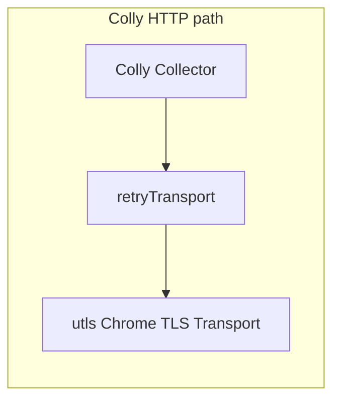

# gocrawl v3.0 — TLS fingerprint, webclaw-style extraction, JS blobs, LLM summary

## Current baseline

- **HTTP path:** [internal/crawler/colly.go](internal/crawler/colly.go) uses Colly with `http.DefaultTransport` (cloned) wrapped by [internal/crawler/retry_transport.go](internal/crawler/retry_transport.go). This fingerprints as **Go**, which many sites block while allowing real browsers (your chromedp path already uses a real TLS stack).
- **Content selection:** `pickContentHTML` uses fixed CSS lists from [internal/crawler/selectors.go](internal/crawler/selectors.go) or user `contentSelector(s)`; markdown is plain `extractor.ToMarkdown` on that HTML subtree ([internal/extractor/markdown.go](internal/extractor/markdown.go)).
- **Docker:** [Dockerfile](Dockerfile) builds with `CGO_ENABLED=0` — **no CGO QuickJS** without changing the image/toolchain.

## 1. TLS fingerprinting (Chrome-like)

**Approach:** Use [refraction-networking/utls](https://github.com/refraction-networking/utls) to dial TLS with a **Chrome ClientHello** profile (e.g. library preset `HelloChrome_Auto` or a pinned version that matches current utls docs), and plug that into a standard `*http.Transport` via `DialTLSContext` (see utls examples / discussions on wrapping `http.Client`).

**Integration points:**

- Add a small factory in `internal/crawler/` (e.g. `chrome_tls_transport.go`) that returns an `http.RoundTripper` configured for:
  - TLS impersonation (uTLS `UClient`)
  - **HTTP/2 where ALPN negotiates it** (use `golang.org/x/net/http2.ConfigureTransport` on the same transport, matching Chrome behavior)
  - Sensible `TLSHandshakeTimeout`, `MaxIdleConnsPerHost`, etc. (mirror defaults from `http.DefaultTransport` where appropriate)
- **Compose with retries:** build base transport → optionally wrap with existing `retryTransport` (order: retry outermost is fine — same as today).
- Wire in **both** [internal/crawler/colly.go](internal/crawler/colly.go) (`ScrapeURL`) and [internal/api/crawl_manager.go](internal/api/crawl_manager.go) so crawl jobs get the same behavior.

**Config (env + [internal/config/config.go](internal/config/config.go)):**

- e.g. `ENABLE_CHROME_TLS=true` (default `false` to avoid surprising proxy/corp environments until validated).
- Document that **User-Agent should match Chrome** when this is on (reuse or set `USER_AGENT` to a current Chrome string); optional auto-default when flag is enabled.

**Out of scope / note:** Chromedp/Lightpanda already uses a real browser TLS stack — no change required there beyond docs.

## 2. Adapt webclaw extractor (Rust → Go)

**Reference:** [webclaw `extractor.rs](https://github.com/0xMassi/webclaw/blob/main/crates/webclaw-core/src/extractor.rs)` — readability-style pipeline: exclude set from CSS selectors, **include selectors** (concatenate matches), **only_main_content** fast path, default **candidate scoring** (`article, main, [role=main], div, section, td`), `noise` gating, `score_node` (text length, semantic bonuses, link-density penalty), then markdown conversion plus **recovery** passes (H1 prepend, announcements, section headings, footer CTA/sitemap, hero paragraph).

**Go implementation strategy (practical):**

- New package under [internal/extractor/](internal/extractor/) (e.g. `content.go`, `noise.go`, `score.go`, `recover.go`) using **goquery** (already in tree via Colly) as the DOM layer.
- Port in **logical chunks** with tests translated from webclaw’s `#[cfg(test)]` blocks in `extractor.rs` (e.g. “picks article over nav”, recovery tests).
- **Dependency on webclaw `noise.rs`:** fetch/port [noise.rs](https://github.com/0xMassi/webclaw/blob/main/crates/webclaw-core/src/noise.rs) (or equivalent rules) — the scorer calls `noise::is_noise` / `is_noise_descendant`; without it, parity breaks.
- **Markdown:** keep [github.com/JohannesKaufmann/html-to-markdown/v2](https://github.com/JohannesKaufmann/html-to-markdown) for subtree → markdown (webclaw has a custom `markdown::convert`; aim for **output shape parity** on key fixtures rather than line-by-line port of Rust markdown).
- **API surface:** extend [internal/crawler/colly.go](internal/crawler/colly.go) `ScrapeRequest` with webclaw-aligned fields, e.g. `excludeSelectors []string`, and map existing `contentSelector` / `contentSelectors` to **include** behavior like webclaw’s `include_selectors`. Keep backward compatibility for current clients (existing fields win or merge with clear precedence — document in README).

**Wiring:** After HTML is available (Colly `OnHTML` and chromedp `buildResultFromMainHTML`), run the new extractor when a flag is set (e.g. `extractor: "webclaw"` or `useAdvancedExtractor: true`) **or** make it the default for v3 with an escape hatch — pick one and document; recommendation: **default on** for scrape/crawl when `onlyMainContent` is true, with `onlyMainContent: false` still meaning full body + simple markdown for legacy behavior.

## 3. JavaScript evaluation (webclaw `js_eval.rs`)

**Reference:** [webclaw `js_eval.rs](https://github.com/0xMassi/webclaw/blob/main/crates/webclaw-core/src/js_eval.rs)` — inline non-module scripts, QuickJS sandbox with **browser stubs**, eval scripts, scan `globalThis` for `_`_* blobs + `__next_f`, `JSON.stringify` large objects, then `extract_readable_text` / RSC parsing.

**Engine choice (important):**

| Option             | Pros                              | Cons                                                    |
| ------------------ | --------------------------------- | ------------------------------------------------------- |
| **QuickJS (CGO)**  | Matches webclaw stack             | Breaks `CGO_ENABLED=0` Alpine build; cross-compile pain |
| **goja (pure Go)** | Fits current Docker/static binary | Not QuickJS; subtle JS differences                      |

**Recommendation:** Implement the **same algorithm and stubs** with **goja** as the default engine so CI/Docker stay static. If you require literal QuickJS, add a **build tag** (e.g. `quickjs`) + separate Dockerfile stage with `CGO_ENABLED=1` and system QuickJS — only if a maintained Go binding is validated.

**Integration:** Optional scrape flag, e.g. `extractJsData: true` — append `extract_readable_text` output to markdown (webclaw-style `## Additional Content` section) or expose a new result field `jsExtractedMarkdown` / metadata key for MCP clients.

## 4. Optional LLM summarize (webclaw `summarize.rs`)

**Reference:** [webclaw `summarize.rs](https://github.com/0xMassi/webclaw/blob/main/crates/webclaw-llm/src/summarize.rs)` — system prompt: “exactly N sentences”, temperature ~0.3, plain text only; strip “thinking” tags defensively.

**Implementation:**

- New small client in `internal/llm/` (or `internal/summarize/`) calling **OpenAI-compatible** `POST {base}/v1/chat/completions` with `model`, `messages`, `temperature`.
- **Config:** `LLM_ENABLED`, `LLM_BASE_URL`, `LLM_API_KEY`, `LLM_MODEL` (defaults empty/off). Supports cheap endpoints (Ollama OpenAI shim, vLLM, OpenRouter, etc.) — models like `Qwen2.5` / vendor-specific IDs are just strings.
- **Request:** optional fields on `ScrapeRequest`, e.g. `summarize bool`, `summaryMaxSentences int`, `summaryModel string` (override default).
- **Response:** optional `summary` on `ScrapeResult`; errors should not fail the scrape if summarize is best-effort (log + omit vs strict — document; recommend best-effort when `summarize` is optional).

## 5. Documentation and versioning

- Update [README.md](README.md), [.env.example](.env.example), and [AGENTS.md](AGENTS.md) for new env vars, scrape JSON fields, TLS/UA notes, and LLM behavior.
- Bump user-facing version string / release notes as **3.0** where the project surfaces a version (if none, add a `VERSION` or `main` banner log — only if already conventional).

## Risk / test checklist

- **uTLS:** verify against a known “blocks Go client” host in an integration test (or manual script) + `go test ./...`.
- **Extractor:** fixture tests from webclaw `extractor.rs` tests.
- **goja eval:** cap runtime (instructions or timeout), memory — inline scripts can be large; mirror webclaw’s limits where possible.
- **LLM:** unit test with `httptest` mock server; no live network in CI.

